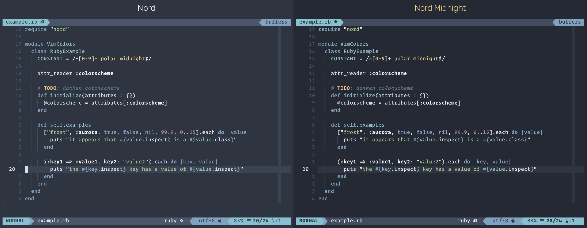

This is an *unofficial* port of [Nord Vim](https://github.com/arcticicestudio/nord-vim) with a darker background for increased text contrast.



## Installation

```viml
Plug 'jcypret/nord-vim-midnight'
colorscheme nord
```

## Color Palette

This "midnight" Nord port alters the standard Polar Night color palette to use four darker shades of gray. In fact, three of the shades are the same, but shifted over by one. This is my attempt to darken the Polar Night palette, increasing the text contrast, while maintaining the integrity of the theme as a whole.

<table>
  <tr>
    <th colspan="5">Polar Night</th>
  </tr>
  <tr>
    <td></td>
    <td>#2E3440</td>
    <td>#3B4252</td>
    <td>#434C5E</td>
    <td>#4C566A</td>
  </tr>
  <tr>
    <td></td>
    <td></td>
    <td></td>
    <td></td>
    <td></td>
  </tr>
  <tr>
    <th colspan="5"></th>
  </tr>
  <tr>
    <th colspan="5">Polar Midnight</th>
  </tr>
  <tr>
    <td>#242933</td>
    <td>#2E3440</td>
    <td>#3B4252</td>
    <td>#434C5E</td>
    <td></td>
  </tr>
  <tr>
    <td></td>
    <td></td>
    <td></td>
    <td></td>
    <td></td>
  </tr>
</table>
